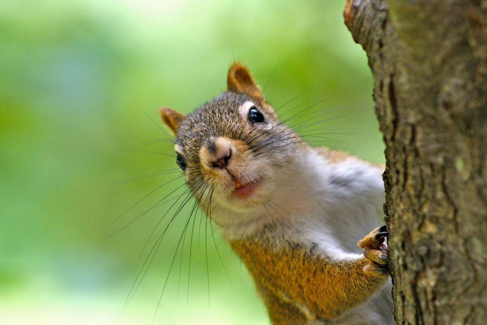
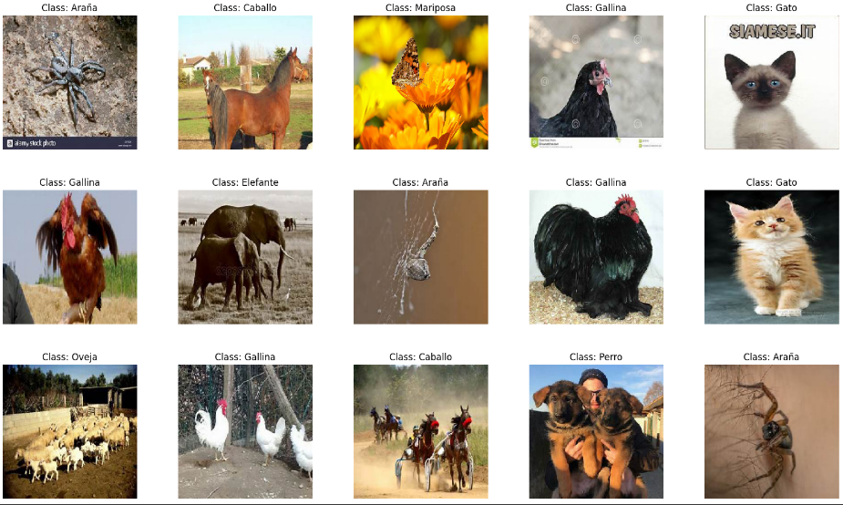
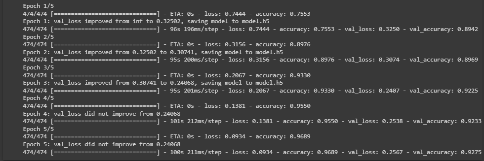
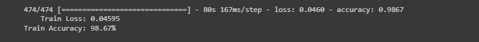
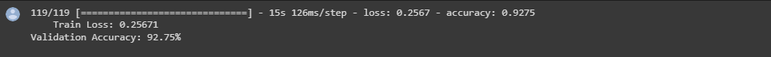
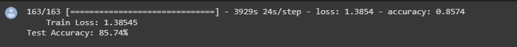

# Animales-RedesNeuronales (Clasificador)
## Proyecto Final de Redes Neuronales


La biodiversidad del mundo(Hoy 22 de Mayo día de la Biodiversidad :D) es demasiado extensa,es bueno poder renoconer a las diferentes especies y me pareció divertido el hecho de que el modelo me recuerda a la educación de un niño , con el aprendizaje de que animal es a temprana edad.

## Datos
El dataset se encuentra en [Kaggle](https://www.kaggle.com/datasets/alessiocorrado99/animals10),pero solo es una carpeta de 10 directorios , no están separadas.Si desea trabajar con los datos separados, aquí se encuentran : [Data](https://drive.google.com/drive/folders/1mSL_WnkOK2ILKEdeH801luO4lNKzVnq2?usp=share_link) y [Test](https://drive.google.com/drive/folders/1mSL_WnkOK2ILKEdeH801luO4lNKzVnq2?usp=share_link).
Teniendo 10 animales, estos :
- Araña
- Gallina
- Perro
- Elefante
- Ardilla
- Gato
- Vaca
- Caballo
- Oveja
- Mariposa

## Manejo de datos
Se preparan los datos ,dimensionamos las fotos a (224,224) para así usarlas en VGG16
```python
IMG_SIZE = (224, 224)
IMG_SHAPE = IMG_SIZE + (3)
data_generator = ImageDataGenerator(rescale = 1/255,
                            validation_split = 0.2)

 train_generator = data_generator.flow_from_directory(
                                        directory=directory,
                                        target_size=IMG_SIZE,
                                        batch_size=32,
                                        color_mode='rgb',
                                        class_mode="categorical",
                                        subset='training',
                                        )
validation_generator = data_generator.flow_from_directory(
                                           directory=directory,
                                           target_size=IMG_SIZE,
                                           batch_size=32,
                                           color_mode='rgb',
                                           class_mode="categorical",
                                           subset='validation',
                                           )
test_generator = data_generator.flow_from_directory(
                                      directory=testdirectory,
                                      target_size=IMG_SIZE,
                                      batch_size=32,
                                      color_mode='rgb',
                                      shuffle=False,
                                      class_mode='categorical')
```


Para realizar esta proyecto se uso un CNN, es una red neuronal convolucional en español. Es un tipo de arquitectura de red neuronal artificial especialmente diseñada para procesar datos con una estructura de cuadrícula, como imágenes o datos en forma de matriz. 

## Transfer learning
El transfer learning (aprendizaje por transferencia) es una técnica utilizada en el campo del aprendizaje automático y las redes neuronales. Consiste en aprovechar el conocimiento adquirido por un modelo entrenado en una tarea para ayudar a mejorar el rendimiento de otro modelo en una tarea relacionada.
Este usado en nuestro proyecto a base de VGG16, un modelo pre-entrenado de 16 capas.
 al ser pre-entrenado en ImageNet, ha aprendido a reconocer una amplia variedad de características y patrones en imágenes naturales. Estas representaciones aprendidas pueden ser transferidas y utilizadas como punto de partida para otras tareas de clasificación o detección de objetos en imágenes.
 Siendo perfecto para nuestro proyecto.

 

 ## Modelo
 Se realiza el modelo 
 ```python
last_output = base_model.output
x = GlobalAveragePooling2D()(last_output)
x = Dense(512, activation='relu')(x)
x = Dropout(0.5)(x)
outputs = Dense(10, activation='softmax')(x)
model = Model(inputs=base_model.inputs, outputs=outputs)
model.compile(optimizer=tf.keras.optimizers.Adam(learning_rate=0.0001),
             loss='categorical_crossentropy',
             metrics=['accuracy'])
```
Donde al correrlo nos regreso :
 
## Evaluación
En la evaluacion regreso los siguientes resultados :
### Train

### Validation

### Test

Dando unos resultados que son optimos y buenos para la Api que se montará.

## API 
Para probar el modelo de forma visual se realizo una api basada en un proyecto del Youtuber [Ringa Tech](https://www.youtube.com/@RingaTech),donde al usar esta aplicación web de detección.Donde tras unos ajuste logre hacer funcionar al proyecto.

Las siguientes fotos se  tomarón desde un dispositivo movil:


.jpeg)
.jpeg)

Esta app esta desarrollada en Html con Tensorflow.js para cargar el modelo,para poder usar la Api se recomienda .
- Descarga Python en tu computadora
- Abre una línea de comandos o terminal
- Navega hasta la carpeta donde descargaste el repositorio
- Ejecuta el comando python -m http.server 8000
- Abre un explorador y ve a http://localhost:8000

Para usarlo en dispositivo movil.
No se puede abrir solo la IP del dispositivo que lo corre ,necesitas hacer un tunel HTTPS,se recomienda.

- Descarga ngrok en tu computadora, y descomprímelo
- Abre una línea de comandos o terminal
- Navega hasta la carpeta donde descargaste ngrok
- Ejecuta el comando ngrok http 8000
- Es importante tener ambos activos: El servidor de python, y el túnel de ngrok
- En la línea de comandos aparecerá un enlace HTTPS. Puedes entrar ahí con tu celular, no - - importa si no estás en la red local.
- El túnel expira después de 2 horas creo, en dado caso solo reinicias ngrok
- Abre un explorador en tu celular y ve al enlace HTTPS indicado